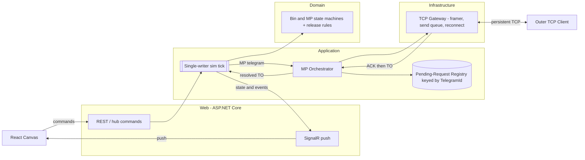
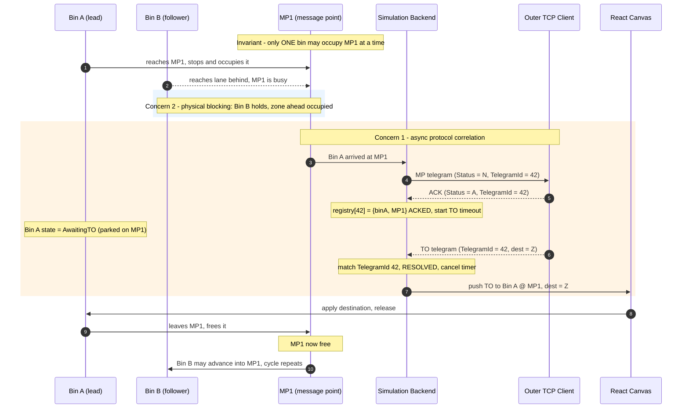
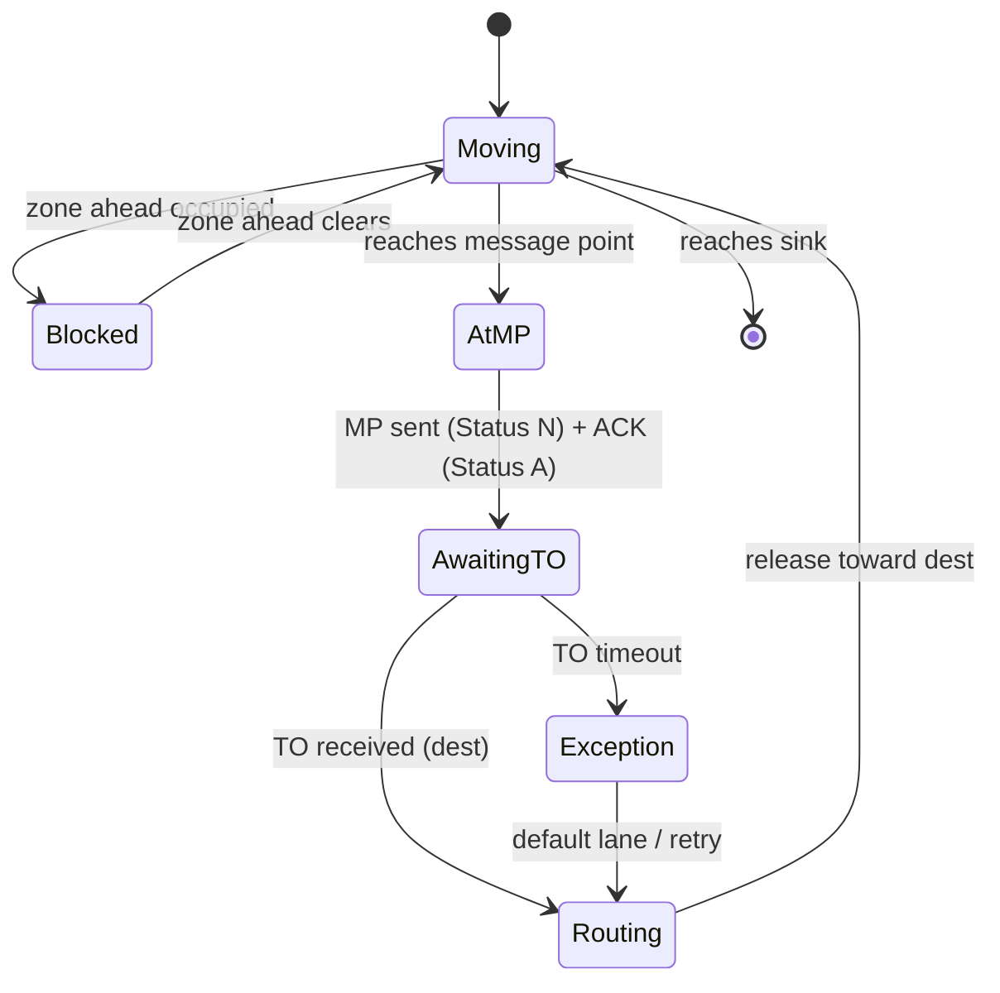

# 12. Message-point (MP/TO) orchestration and backend-authoritative simulation

- **Status:** Accepted
- **Date:** 2026-08-13
- **Deciders:** PlcTelegramSimulator team

## Context and problem statement

The Conveyor Simulation Canvas (frontend-only today; see [AGENTS.md](../../AGENTS.md)) animates
bins along belts entirely in the browser. The next slice makes it *telegram-driven*: when a bin
reaches a **Message Point (MP)** — a reporting location on the conveyor — the simulator must report
that arrival to an external host and **wait for a Transport Order (TO)** carrying the bin's next
destination before the bin may move on.

The exchange is asynchronous and request/response over a persistent TCP connection:

1. A bin reaches an MP and stops (an MP holds **one** bin at a time).
2. The backend sends an **MP telegram** outbound (header `Status = N` "new") to the outer TCP client.
3. The client returns an **acknowledgement** (`Status = A` "acknowledged" — transport receipt only).
4. The backend **awaits** the **TO telegram** (next destination) for that request.
5. On receipt, the backend pushes the destination to the canvas, which releases the bin.

Two forces make this non-trivial and must be pinned down together:

- **Concurrency & ordering.** With several MPs active at once (e.g. five bins on five MPs), MP
  sends are *pipelined*; TOs come back **out of order**. Each TO must be matched to its originating
  MP request, and any TO may never arrive (timeout).
- **Physical blocking.** On a lane the **lead bin** parked at its MP awaiting a TO **blocks the
  followers behind it** — correct accumulation behaviour, but it is a *simulation* rule, not a
  transport rule, and must not be tangled into the messaging layer.

A third question is now unavoidable: **where does the authoritative simulation run?** Today the
physics (motion, blocking) live in the browser (`useCanvasSimulation` + `requestAnimationFrame`),
while the TO decision lives in the backend — a split-brain that races exactly on "when may a bin
move". Constraints: reuse **SignalR** ([ADR-0006](0006-real-time-transport.md)), the REST control
plane and two-socket TCP model ([ADR-0007](0007-connection-api-and-transport-model.md)), the
hexagonal layering ([ADR-0003](0003-repository-structure.md) /
[ADR-0005](0005-backend-architecture-and-patterns.md)), EOF-terminated framing
([ADR-0011](0011-eof-terminated-telegram-framing.md)), and the existing telegram header whose
`TelegramId` and `Status` fields already exist ([ADR-0009](0009-telegram-template-model.md) /
[ADR-0010](0010-telegram-field-groups.md)). This is a single-process simulator.

## Decision drivers

- **Correctness under concurrency** — out-of-order TOs and per-lane FIFO blocking need one
  deterministic authority, not two tiers negotiating over the wire.
- **Reuse existing transport** — SignalR push + REST commands + the TCP gateway already exist; add
  no new infrastructure without a concrete need (YAGNI).
- **Boundary isolation** — keep protocol correlation, simulation rules, and I/O in their proper
  hexagonal layers so each evolves and tests independently.
- **Testability** — exercise the orchestration and release rules without sockets or HTTP.
- **Smooth UX** — the canvas must still animate fluidly even though the backend owns the truth.

## Considered options

**Where the simulation runs:**

1. **Backend-authoritative simulation + thin React renderer** (server-authoritative with client
   interpolation).
2. **Frontend-authoritative simulation**; the backend only performs the TCP MP/TO handshake and
   returns destinations.
3. **Shared/dual simulation** on both tiers, reconciled over the wire.

**How the tiers and the backend communicate:**

- **A. SignalR push + REST/hub commands + in-process events** (C# events / `System.Threading.Channels`).
- **B. An external message broker** (RabbitMQ / Kafka / Redis Streams) between React and the
  backend and/or between backend components.

## Decision outcome

**Chosen option:** "Backend-authoritative simulation (Option 1) with SignalR + in-process events
(Option A)." The backend owns the simulation truth and correlates MP→TO through a
**Pending-Request Registry keyed by `TelegramId`**; the React canvas becomes a thin renderer that
sends *commands* and draws *authoritative state*. **No external message bus** is introduced — a
single-process simulator does not earn a broker, and SignalR already provides resilient
server→client push.

### Layer mapping (per ADR-0003 / ADR-0005)

- **Domain** — bin/MP **state machines** and lane **release rules** (pure, no I/O).
- **Application** — the **MP Orchestrator**, the **Pending-Request Registry**
  (`TelegramId → { binId, mpId, phase, timer }`), and a **single-writer simulation tick** behind
  ports.
- **Infrastructure** — the **TCP Gateway** (framer/parser, outbound send queue, reconnect/heartbeat)
  over the two-socket model of [ADR-0007](0007-connection-api-and-transport-model.md).
- **Web** — the **SignalR hub** (authoritative state + events to the canvas) and **REST/hub
  commands** (spawn bin, play/pause, place component, inject fault).

### The two concerns, decoupled

**Concern 1 — async protocol correlation.** MP sends are pipelined; the registry pairs each inbound
TO to its request by `TelegramId`, independent of arrival order. A request moves through a
**two-phase** lifecycle — `PENDING_ACK → ACKED → RESOLVED` — with **separate timeouts** (a missing
ACK is a transport fault; a missing TO is a host/decision fault, surfaced via `ErrorCode` /
an error telegram). Because a bin blocks at its MP, each bin has **at most one** outstanding request.

**Concern 2 — physical blocking.** A follower stops purely because the **zone ahead is occupied**,
never because it "knows" about anyone's TO. The lead bin holds the zone while its own state is
`AwaitingTO`. The two concerns touch at exactly one point: the TO **resolving** releases the lead
bin, which frees the MP, which unblocks the follower.

Per-bin state machine (blocking is emergent; the MP/TO handshake is one transition band):

### Single-writer simulation loop

All simulation state is mutated by **one** deterministic tick. Socket read threads, timeout timers,
and UI commands **never** touch state directly — they enqueue events onto `System.Threading.Channels`
that the tick drains, updates the state machines, and then emits a snapshot/delta over SignalR. This
single-writer (actor) discipline is what keeps concurrent, out-of-order TOs race-free; all backend
I/O stays `async` with `CancellationToken`.

### Frontend contract

- **React → backend:** commands/intents (spawn bin, play/pause, place/adjust component, inject
  fault) via REST or hub invoke.
- **Backend → React:** authoritative state + domain events (`BinMoved`, `MpReported`, `ToApplied`,
  `BinBlocked`, `Fault`) via SignalR. The canvas **interpolates** motion between snapshots for
  smooth animation while treating the backend as the source of truth.

Option 2 (frontend-authoritative) was rejected because the blocking/release gate would live in the
browser, out of sync with the host that actually issues TOs. Option B (message broker) was rejected
because a single process with one UI gains nothing from broker infrastructure; SignalR plus
in-process eventing covers push, and a broker can be revisited only if the simulator ever scales to
multiple hosts or external subscribers.

### Consequences

- **Positive:** one deterministic authority makes concurrent, out-of-order, blocking handshakes
  correct and testable without I/O; the protocol layer (correlation) and the simulation layer
  (release rules) are cleanly separated; reuses SignalR/REST/TCP with **no new dependencies**;
  `TelegramId`-keyed correlation and the `N → A` status flow map onto telegram fields that already
  exist.
- **Negative:** the current in-browser simulation must migrate to the backend, and the canvas needs
  **client-side interpolation** to stay smooth against snapshot/delta updates; the backend gains a
  simulation loop, a registry with timers, and a larger command/event DTO surface to maintain.
- **Neutral / follow-ups:** specify **timeout & retry** policy (ACK vs TO) and **exception routing**
  (default lane / hold / retry); define **back-pressure** on the outbound send queue; handle
  **unmatched / duplicate / late** TOs idempotently and **reconnect resync** of outstanding
  requests; decide exact **socket routing** of MP-out vs TO-in across the two-socket model
  (ADR-0007); pin the concrete **command/event DTOs**; and address **layout/scenario persistence**
  (still in-browser, like [ADR-0009](0009-telegram-template-model.md)) and any scale-out backplane
  in their own future ADRs.
