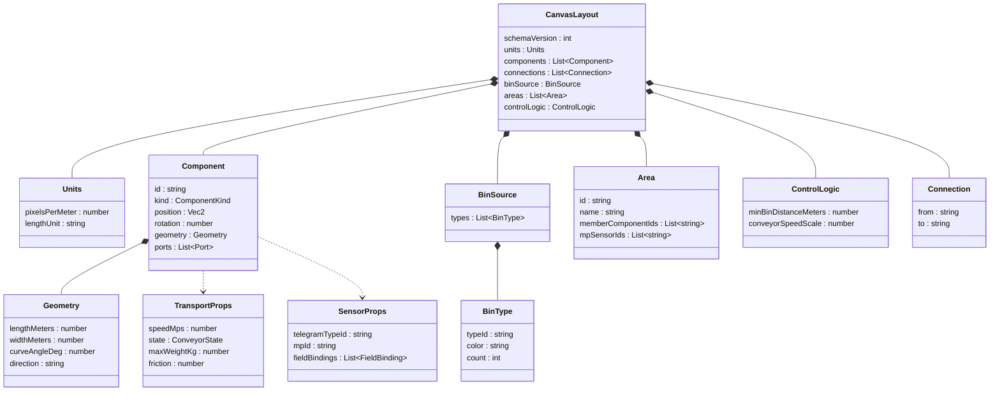
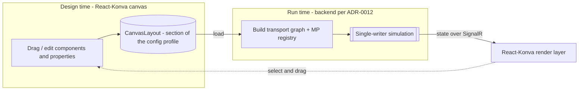

# 13. Conveyor canvas: React-Konva rendering and a versioned JSON layout model

- **Status:** Accepted
- **Date:** 2026-08-13
- **Deciders:** PlcTelegramSimulator team

## Context and problem statement

The Conveyor Simulation Canvas today is a first-slice prototype: absolutely-positioned HTML
`<div>`/`<button>` nodes with `requestAnimationFrame` motion and an in-browser-only model
(`CanvasNode` / `NodeProps`, geometry in raw pixels; see
`src/frontend/src/features/canvas/`). It proved the UX but cannot become a real conveyor
**editor**: there is no free-form dragging, no zoom/pan, no true geometry for curved/U-shaped/incline
belts, no engineering-unit model, no persistence, no telegram binding, and no way to group
components into areas.

We now need a proper **authoring surface plus renderer** with:

- **Transport** components — straight belt, curved belt (45°/90°), U-shape, incline, decline, merge —
  each with engineering **properties**: speed, real **length** and **width** (converted to canvas
  units), state (`Running` / `Stopped` / `Jammed` / `Maintenance`), max weight / capacity, and
  friction (higher friction ⇒ slower bins).
- **Sensors** — the points that emit a telegram to the connected client and receive the next
  destination back (feeding the MP/TO orchestration of
  [ADR-0012](0012-mp-to-orchestration-and-simulation-authority.md)). Each sensor **binds a telegram
  type**; an **MP sensor** owns a unique **`mpId`** that the user connects, from the property panel,
  to the telegram's **`MP`** field.
- **Environment** — a **Bin Source** holding configurable **bin types** (count and colour per type),
  where each spawned bin gets a random **TU Id** that also rides in the telegram; and a **Sink**.
- **Areas** — a mechanism to declare that a set of components/MP-sensors belongs to a named area.
- **Control logic** — global tunables such as minimum **distance between bins** and conveyor
  **speed**.

The whole configuration (component positions and every property) must persist as a **JSON file** so a
layout can be saved, reloaded, shared, version-controlled, and **consumed by the backend simulation**
(ADR-0012). Constraints: the React + TS + Vite + Tailwind stack; a versioned JSON **configuration
profile** already exists ([ADR-0008](0008-configuration-profile.md), one top-level section per
feature); telegram types come from [ADR-0009](0009-telegram-template-model.md) /
[ADR-0010](0010-telegram-field-groups.md); runtime simulation authority is fixed by ADR-0012.

## Decision drivers

- **Rich, performant 2D canvas** — free-form drag, zoom/pan, custom vector shapes for curves / U /
  incline, and hundreds of nodes without DOM-reflow cost.
- **Declarative React integration** — keep our React state model and testability rather than an
  imperative canvas managed outside React.
- **A portable, versioned, diffable layout document** both tiers can read — the design-time contract
  the backend loads to build its transport graph and MP registry.
- **Engineering fidelity** — a real-unit model (metres, m/s) with a canvas **scale** so lengths,
  widths, and speeds are meaningful and convertible, not arbitrary pixels.
- **Telegram-centric** — sensors bind to telegram types; `mpId` ↔ telegram `MP` field; TU Id on bins
  — the north star is producing/consuming telegrams.
- **Extensibility** — the component taxonomy and property set grow without reworking storage.

## Considered options

**Rendering technology:**

1. **React-Konva** (React bindings over Konva.js `<canvas>`) — `Stage` / `Layer` / `Group` /
   `Rect` / `Line` / `Arc` / `Path` / `Transformer`.
2. **Keep HTML/CSS** absolutely-positioned divs (current) + `requestAnimationFrame`.
3. **SVG** (hand-rolled or a React SVG wrapper) — declarative vectors in the DOM.
4. **A node-graph / diagram library** — **React Flow (xyflow)**; or heavier canvas engines
   **PixiJS** / **Fabric.js**.

**Layout persistence:**

- **A. A versioned `canvas` section inside the existing ADR-0008 configuration profile** — reuse its
  envelope, `schemaVersion`, per-section validator, and import/export.
- **B. A separate JSON file** just for the canvas.
- **C. Browser `localStorage` only**, or **D. a backend database now**.

## Decision outcome

**Chosen option:** "React-Konva for rendering (Option 1) + a versioned **`CanvasLayout`** stored as a
new top-level section of the ADR-0008 configuration profile (Option A)."

React-Konva gives a real `<canvas>` with declarative React components, built-in **drag** (`draggable`
+ `Transformer` for select/move/rotate), zoom/pan on the `Stage`, custom geometry via `Line`/`Arc`/
`Path` (curves, U-shapes, incline hatching), and hit-testing for selection — at canvas performance,
while staying idiomatic React and unit-testable at the model level. HTML divs (2) can't express real
belt geometry and reflow poorly at scale; SVG (3) is declarative but slower with many nodes and more
awkward for custom curves; React Flow (4) is optimised for node/edge **graphs**, not free-form
conveyor geometry with real dimensions, and Pixi/Fabric are heavier and less React-idiomatic.

Persisting the layout as a **section of the existing profile** (A) reuses ADR-0008's portability,
additive versioning, safe-import validation, and no-secrets rule — exactly the "future section" that
ADR-0008 anticipated — instead of sprawling into a second file (B), a non-shareable `localStorage`
blob (C), or premature backend persistence (D).

### The `CanvasLayout` model

Static **topology + properties** are authoritative and persisted; **runtime** state (bin positions,
sim clock) stays transient and is owned by the backend simulation (ADR-0012). Real engineering units
are stored; canvas pixels are **derived** at render time from `units.pixelsPerMeter`.



As a `canvas` section of the ADR-0008 profile (illustrative):

```jsonc
"canvas": {
  "schemaVersion": 1,
  "units": { "pixelsPerMeter": 40, "lengthUnit": "m" },
  "components": [
    {
      "id": "belt-1", "kind": "straight-belt",
      "position": { "x": 120, "y": 200 }, "rotation": 0,
      "geometry": { "lengthMeters": 5, "widthMeters": 0.6, "direction": "east" },
      "ports": [ { "id": "belt-1:in", "role": "in" }, { "id": "belt-1:out", "role": "out" } ],
      "transport": { "speedMps": 0.5, "state": "Running", "maxWeightKg": 50, "friction": 0.2 }
    },
    {
      "id": "curve-2", "kind": "curved-belt",
      "position": { "x": 320, "y": 200 }, "rotation": 0,
      "geometry": { "lengthMeters": 1.2, "widthMeters": 0.6, "curveAngleDeg": 90 },
      "ports": [ { "id": "curve-2:in", "role": "in" }, { "id": "curve-2:out", "role": "out" } ],
      "transport": { "speedMps": 0.5, "state": "Running", "maxWeightKg": 50, "friction": 0.25 }
    },
    {
      "id": "mp-10", "kind": "mp-sensor",
      "position": { "x": 300, "y": 200 }, "rotation": 0,
      "sensor": {
        "telegramTypeId": "TG_TRACKING_UPDATE",
        "mpId": "MP10",
        "fieldBindings": [
          { "field": "MP", "source": "mpId" },
          { "field": "TU", "source": "bin.tuId" }
        ]
      }
    }
  ],
  "connections": [ { "from": "belt-1:out", "to": "curve-2:in" } ],
  "binSource": {
    "id": "src-1",
    "types": [
      { "typeId": "TOTE",   "color": "#3b82f6", "count": 20 },
      { "typeId": "CARTON", "color": "#f59e0b", "count": 10 }
    ]
  },
  "areas": [
    { "id": "area-inbound", "name": "Inbound", "memberComponentIds": ["belt-1", "curve-2"], "mpSensorIds": ["MP10"] }
  ],
  "controlLogic": { "minBinDistanceMeters": 0.3, "conveyorSpeedScale": 1.0 }
}
```

Notes: components connect through named **ports** so `connections[]` forms the directed transport
graph the backend consumes; **incline/decline** are transport kinds carrying a slope in `geometry`
and rendered with a distinct visual (e.g. hatching / arrow); a **sensor's** `fieldBindings` wire its
`mpId` into the bound telegram's `MP` field and the bin's **TU Id** into the `TU` field; **areas**
reference component/MP-sensor ids; **control-logic** globals tune spacing and speed.

### Relationship to ADR-0012

The `CanvasLayout` is the **design-time contract**; ADR-0012 owns **run time**. The backend loads the
layout to build its transport graph and MP registry, sensors' `mpId` + `telegramTypeId` drive the
MP→TO exchange, and the React-Konva **render layer** draws backend-authoritative bin motion over the
static topology.



### Adjustments to prior decisions

- **Resolves deferred follow-ups.** This is the "layout/scenario persistence" ADR that
  [ADR-0012](0012-mp-to-orchestration-and-simulation-authority.md) deferred, and the `simulation`/
  layout section [ADR-0008](0008-configuration-profile.md) anticipated. No supersession is needed;
  both remain **Accepted** and are complemented here.
- **Supersedes the prototype model (implementation-level).** The current px-absolute `CanvasNode` /
  `NodeProps` and the div/rAF stage are replaced by this real-unit model rendered with React-Konva —
  a rewrite of `src/frontend/src/features/canvas/`, not a separate ADR.
- **No change to simulation authority.** The layout JSON is design-time config only; runtime remains
  backend-authoritative (ADR-0012).

### Consequences

- **Positive:** a genuine editor (free-form drag, zoom/pan, real curve/U/incline geometry) at canvas
  performance while staying declarative and testable at the model level; one portable, versioned,
  diffable layout that both tiers share and that directly feeds MP/TO orchestration; real engineering
  units make speed/length/width/friction meaningful and convertible; the taxonomy and properties grow
  additively inside the existing profile.
- **Negative:** adds the `react-konva` + `konva` dependencies (bundle size); **Konva does not render
  in jsdom**, so Vitest coverage targets the layout model / hooks / geometry math and **mocks
  react-konva** (no pixel assertions); the current canvas is a **rewrite**; a richer schema means more
  validation and versioning discipline (ADR-0008 rules); curve/U/incline geometry and unit-scale math
  are non-trivial.
- **Neutral / follow-ups:** pin the exact `CanvasLayout` TypeScript types + validator + a formal JSON
  Schema; define **port-graph** semantics for curves / merge / (future) diverter and how **areas** map
  to backend zones; specify **TU Id** generation and the sensor→telegram field-binding UI
  (ADR-0009/0010) that feeds ADR-0012; choose the **incline/decline** visualisation; add editor
  niceties (snapping, grid, undo/redo, overlap rules); implement the **backend layout loader**
  (ADR-0012); and land it as a vertical slice — render one straight belt + one MP sensor from a
  `CanvasLayout`, drag to persist, then wire an end-to-end MP→TO round-trip.
